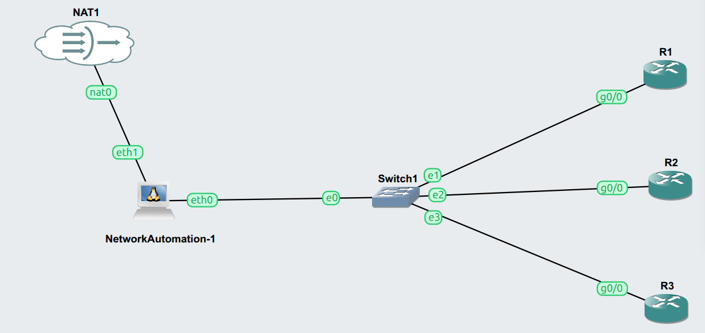

# GNS3 Network Automation Lab — Ansible for Networking

A hands-on training lab for learning **network automation with Ansible** against Cisco IOS
devices running in **GNS3**. Built as a ~3.5 hour instructor-led session for trainees who
already know Ansible basics (ad-hoc commands, simple playbooks) and now want to apply them
to network devices.



---

## What's in this repo

```
.
├── README.md
├── topology.png                 # the GNS3 topology (screenshot above)
├── ansible.cfg                  # Ansible configuration for the lab
├── inventory.yml                # the three routers
├── group_vars/
│   └── routers.yml              # connection vars (network_cli, credentials)
├── host_vars/                   # per-router variables (OSPF, etc.)
│   ├── R1.yml
│   ├── R2.yml
│   └── R3.yml
├── templates/
│   └── ospf.j2                  # Jinja2 template for OSPF config
└── playbooks/
    ├── 01-facts.yml             # gather & display device facts
    ├── 02-verify.yml            # show commands / verification
    ├── 03-loopbacks.yml         # push config + idempotency demo
    ├── 04-ospf.yml              # deploy OSPF from a template
    └── 05-backup.yml            # back up running configs
```

> Adjust the file list above to match what you actually commit.

---

## Lab topology

```
NAT1 ── eth1 [ NetworkAutomation ] eth0 ── Switch1 ── R1
        (internet, temporary)  (control node)    │  ├─ R2
                                                  └─ R3
```

| Node | Role | Management IP |
|------|------|---------------|
| NetworkAutomation | Ansible control node (Docker) | `192.168.100.10` |
| R1 | Cisco IOS router | `192.168.100.11` |
| R2 | Cisco IOS router | `192.168.100.12` |
| R3 | Cisco IOS router | `192.168.100.13` |
| Switch1 | Management LAN (built-in Ethernet switch) | — |
| NAT1 | Internet access for the control node (setup only) | DHCP |

- **Management subnet:** `192.168.100.0/24` — a flat LAN, no gateway needed for the lab itself.
- **NAT1** is only used once, to give the control node internet access while installing
  tools. It can be disconnected afterwards.

---

## Requirements

- **GNS3 2.2.x** (this lab was built on 2.2.60)
- **Cisco IOS router image** for R1–R3. This lab uses Cisco c7200 (IOS 15.x); vIOS-L3 works
  too. Any IOS 15.x image with SSHv2 support is fine.
- **Network Automation** Docker appliance (from the GNS3 marketplace) as the control node —
  ships with Ansible, Netmiko, and NAPALM.
- On **Windows**, GNS3 must be installed **with the GNS3 VM** (Docker nodes run inside it).
  On Linux, GNS3 uses the host's Docker directly.

> **Note on the router interface name:** on a c7200 with the default I/O card the management
> interface is `FastEthernet0/0`. On vIOS-L3 it is `GigabitEthernet0/0`. Use whichever your
> image presents — the diagram labels show `g0/0`.

---

## Setup

### 1. Build the topology in GNS3

Recreate the topology shown above, or import the project if one is provided. Cable the
control node's `eth0` to Switch1 and each router's management interface to Switch1.

### 2. Prepare each router (one-time)

Console into each router and apply a baseline that enables SSH. Example for **R1** (repeat
with `.12` / `.13` for R2 / R3, and use `GigabitEthernet0/0` instead if on vIOS):

```
enable
configure terminal
hostname R1
ip domain-name lab.local
username ansible privilege 15 secret ansible123
!
interface FastEthernet0/0
 description MGMT
 ip address 192.168.100.11 255.255.255.0
 no shutdown
!
crypto key generate rsa modulus 2048
ip ssh version 2
!
line vty 0 4
 login local
 transport input ssh
!
end
write memory
```

### 3. Prepare the control node (one-time)

Give the NetworkAutomation node its IP by editing its network config
(right-click → **Edit config**, or `/etc/network/interfaces`):

```
auto eth0
iface eth0 inet static
    address 192.168.100.10
    netmask 255.255.255.0
```

To install/upgrade tools, temporarily add a second adapter cabled to a NAT node for internet:

```bash
# with the NAT link attached:
pip3 install --upgrade ansible
apt-get update && apt-get install -y vim
```

> ⚠️ **Do NOT run `ansible-galaxy collection install cisco.ios` on this appliance.**
> The container's Python is 3.8, so Ansible upgrades only to core 2.13, but Galaxy installs
> the *latest* `cisco.ios` (which needs core ≥ 2.16). That mismatch breaks `network_cli`
> with errors like *"Connection type ssh is not valid for this module"*. The `ansible` pip
> package already **bundles** compatible collections (`cisco.ios` 3.3.2, `ansible.netcommon`
> 3.1.3). If you already ran the Galaxy install, remove it:
> ```bash
> rm -rf /root/.ansible/collections/ansible_collections/cisco
> rm -rf /root/.ansible/collections/ansible_collections/ansible
> hash -r
> ```

Confirm you have compatible versions:

```bash
ansible --version                                        # core 2.13.x
ansible-galaxy collection list | grep -E "cisco.ios|netcommon"
# cisco.ios 3.3.2, ansible.netcommon 3.1.3
```

Once tools are installed, the NAT node can be disconnected — the lab only needs `eth0`.

### 4. Verify connectivity

From the control node:

```bash
ping -c 2 192.168.100.11
ansible all -i "192.168.100.11," -m cisco.ios.ios_facts \
  -e "ansible_connection=ansible.netcommon.network_cli \
      ansible_network_os=cisco.ios.ios \
      ansible_user=ansible ansible_password=ansible123 \
      ansible_become=true ansible_become_method=enable"
```

A block of green facts means the control node can reach and log into the router.

---

## Configuration files

**ansible.cfg**

```ini
[defaults]
inventory = inventory.yml
host_key_checking = False
gathering = explicit
stdout_callback = yaml
```

**inventory.yml**

```yaml
routers:
  hosts:
    R1:
      ansible_host: 192.168.100.11
    R2:
      ansible_host: 192.168.100.12
    R3:
      ansible_host: 192.168.100.13
```

**group_vars/routers.yml**

```yaml
ansible_connection: ansible.netcommon.network_cli
ansible_network_os: cisco.ios.ios
ansible_user: ansible
ansible_password: ansible123
ansible_become: true
ansible_become_method: enable
```

> For anything beyond a lab, store credentials with **Ansible Vault** instead of plaintext.

---

## Running the playbooks

```bash
# gather and display device facts
ansible-playbook playbooks/01-facts.yml

# verification / show commands
ansible-playbook playbooks/02-verify.yml

# push config — dry run first, then for real, then again to prove idempotency
ansible-playbook playbooks/03-loopbacks.yml --check --diff
ansible-playbook playbooks/03-loopbacks.yml
ansible-playbook playbooks/03-loopbacks.yml     # changed=0 the second time

# deploy OSPF from a Jinja2 template
ansible-playbook playbooks/04-ospf.yml

# back up running configs to ./backups/
ansible-playbook playbooks/05-backup.yml
```

Useful flags: `--limit R1` (one host), `--check --diff` (dry run), `-vvv` (verbose).

---

## Troubleshooting

| Symptom | Cause / Fix |
|---------|-------------|
| `Connection type ssh is not valid for this module` | Incompatible `cisco.ios` from Galaxy — remove it (see setup step 3) so the bundled version loads. |
| Playbook hangs on first connect | `host_key_checking` not disabled — set it in `ansible.cfg`. |
| `Invalid input detected` on config tasks | Missing `ansible_become: true` — config mode needs enable. |
| SSH key-exchange / no matching cipher | Old IOS crypto. Add legacy algorithms to `~/.ssh/config` on the control node (`KexAlgorithms +diffie-hellman-group14-sha1`, `HostKeyAlgorithms +ssh-rsa`, `PubkeyAcceptedAlgorithms +ssh-rsa`). |
| `ping` module fails on routers | Expected — the `ping` module needs Python on the target. Use `ios_facts` or `cli_command` to test reachability instead. |
| Docker node won't start (Windows) | GNS3 VM not running — Docker nodes run inside it on Windows. |

---

## Notes

- **Snapshots:** take a GNS3 snapshot after the baseline config so you can reset the lab
  instantly between exercises.
- **Custom image:** to avoid repeating the control-node setup on every node, bake it into a
  custom image once with `docker commit <container> network_automation_custom:v1` and point
  the GNS3 template at it.
- **Credentials in this repo are lab-only** (`ansible123`) — never reuse them anywhere real.

---

## License

Provided as-is for training and educational use.
